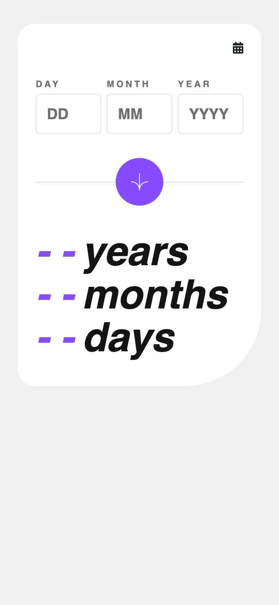
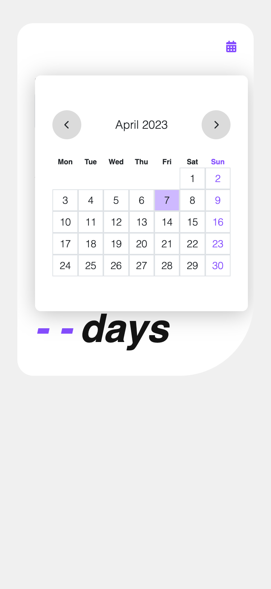
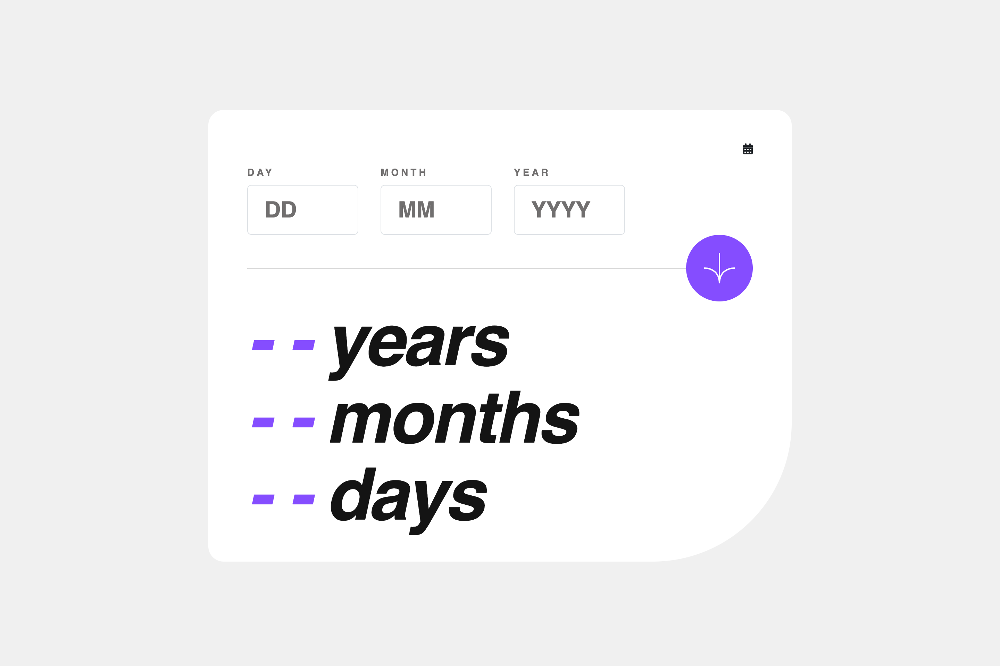
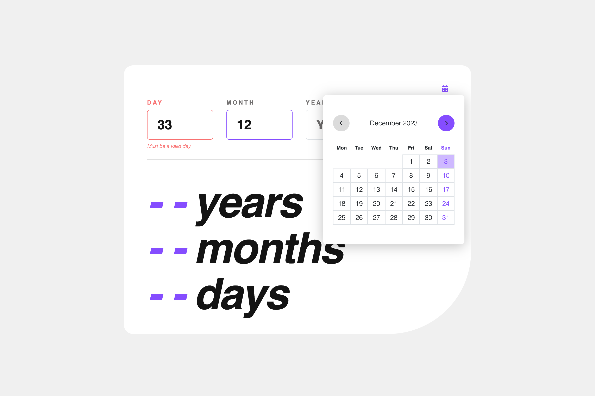

# Frontend Mentor - Age calculator app solution

This is my solution to the [Age calculator app challenge on Frontend Mentor](https://www.frontendmentor.io/challenges/age-calculator-app-dF9DFFpj-Q). Frontend Mentor challenges help you improve your coding skills by building realistic projects. 

## Table of contents

- [Overview](#overview)
  - [The challenge](#the-challenge)
  - [Screenshot](#screenshot)
  - [Links](#links)
- [My process](#my-process)
  - [Built with](#built-with)
  - [What I learned](#what-i-learned)
- [Author](#author)

## Overview

### The challenge

Users should be able to:

- View an age in years, months, and days after submitting a valid date through the form
- Receive validation errors if:
  - Any field is empty when the form is submitted
  - The day number is not between 1-31
  - The month number is not between 1-12
  - The year is in the future
  - The date is invalid e.g. 31/04/1991 (there are 30 days in April)
- View the optimal layout for the interface depending on their device's screen size
- See hover and focus states for all interactive elements on the page
- See the age numbers animate to their final number when the form is submitted
- Toggle the calendar display when the calendar icon is clicked
- Select a date from the calendar and see the date displayed in the inputs

***
### Screenshot

#### Mobile

   
   

#### Desktop

   
    

***

### Links

- GitHub: [https://github.com/Hikmahx/age-calculator](https://github.com/Hikmahx/age-calculator)
<!-- - Solution URL: [Add solution URL here](https://your-solution-url.com) -->
- Live Site URL: [https://age-calculator-hikmahx.vercel.app](https://age-calculator-hikmahx.vercel.app)

## My process

### Built with

- Semantic HTML5 markup
- CSS custom properties
- Flexbox
- Mobile-first workflow
- [Tailwindcss](https://tailwindcss.com/) - CSS framework
- TypeScript
- [Redux Toolkit](https://redux-toolkit.js.org/) - Toolset for efficient Redux development
- [React](https://reactjs.org/) - JS library
- [Vite](https://vitejs.dev/) - JS tool
- React libraries/packages: dayjs, react-hook-form, react-redux, react-countup

### What I learned
After encountering problems with create-react-app, I made the switch to Vite, which has been a much smoother experience overall. Additionally, working with TypeScript has become increasingly clear and easier for me.

## Author

- Github - [Hikmah Yousuph](https://github.com/Hikmahx)
- Frontend Mentor - [@Hikmahx](https://www.frontendmentor.io/profile/Hikmahx)
- Email - [hikmayousuph@gmail.com](hikmayousuph@gmail.com)
- LinkedIn - [Hikmah Yousuph](linkedin.com/in/hikmah-yousuph-449467204/)

